# FinMem: LLM-Based Stock Trading Agent Architecture & Technical Documentation

> **Paper:** [FinMem: A Performance-Enhanced LLM Trading Agent with Layered Memory and Character Design](https://arxiv.org/abs/2311.13743) 
> **Published at:** ICLR Workshop LLM Agents (2024); AAAI Spring Symposium on Human-Like Learning 
> **Codebase:** `pipiku915/FinMem-LLM-StockTrading`

---

## Table of Contents

1. [System Overview](#1-system-overview)
2. [Repository Structure](#2-repository-structure)
3. [High-Level Architecture Diagram](#3-high-level-architecture-diagram)
4. [Module Reference](#4-module-reference)
5. [Data Pipeline](#5-data-pipeline)
6. [Agent Lifecycle & Step Loop](#6-agent-lifecycle--step-loop)
7. [Memory System BrainDB](#7-memory-system--braindb)
8. [Memory Scoring & Retrieval](#8-memory-scoring--retrieval)
9. [LLM Reflection Pipeline](#9-llm-reflection-pipeline)
10. [Portfolio & Feedback Loop](#10-portfolio--feedback-loop)
11. [Train vs. Test Mode Flows](#11-train-vs-test-mode-flows)
12. [Configuration Reference](#12-configuration-reference)
13. [LLM Provider Abstractions](#13-llm-provider-abstractions)
14. [Checkpoint System](#14-checkpoint-system)
15. [End-to-End Flow Diagram](#15-end-to-end-flow-diagram)

---

## 1. System Overview

FinMem is a novel **LLM-based autonomous trading agent** that mimics human cognitive memory processes. It consists of three core conceptual modules:

| Module | Role |
|--------|------|
| **Profiling** | Defines the agent's persona, domain expertise, and character string used as a perpetual query anchor |
| **Memory** | Hierarchical layered memory (Short Mid Long + Reflection) backed by vector databases and scored compound retrieval |
| **Decision-Making** | LLM-powered reflection + guardrails-validated output buy / sell / hold |

The agent operates in two sequential phases:
- **Train Mode:** Agent accumulates memories from historical data, learns which memories correlate with market movements (no real trading decisions are made the agent uses hindsight to build its knowledge base)
- **Test Mode:** Agent uses accumulated memories to make live investment decisions (buy/sell/hold)

---

## 2. Repository Structure

```
FinMem-LLM-StockTrading/
 run.py # CLI entry point (Typer app)
 run_cerebras.sh # Shell launcher for Cerebras LLM
 run_gemini.sh # Shell launcher for Gemini LLM
 run_tgi.sh # Shell launcher for HuggingFace TGI
 save_file.py # Utility to persist results
 .env / .env.example # API keys (CEREBRAS_API_KEY, HF_TOKEN)

 config/
 tsla_cerebras_config.toml # Config for Cerebras (Qwen model)
 tsla_gemini_config.toml # Config for Gemini
 tsla_tgi_config.toml # Config for HuggingFace TGI

 puppy/ # Core source package
 __init__.py # Exports: MarketEnvironment, LLMAgent, RunMode
 agent.py # LLMAgent + TextTruncator
 memorydb.py # MemoryDB (single layer) + BrainDB (orchestrator)
 reflection.py # LLM reflection call, guardrails schema factories
 chat.py # ChatOpenAICompatible (multi-backend LLM client)
 embedding.py # HuggingFaceEmb (FAISS embedding)
 environment.py # MarketEnvironment (data iterator)
 portfolio.py # Portfolio (position tracking, feedback, momentum)
 prompts.py # All LLM prompt templates
 run_type.py # RunMode enum (Train/Test)
 memory_functions/
 __init__.py
 importance_score.py # Probabilistic importance initialization per layer
 compound_score.py # LinearCompoundScore (recency + importance + similarity)
 decay.py # ExponentialDecay for scores
 access_counter.py # LinearImportanceScoreChange (reward/penalty)
 recency.py # R_ConstantInitialization (always 1.0)

 data-pipeline/ # Data preparation scripts
 README.md
 01_SEC_API_10k10q_download.py
 01_Alpaca_News_API_download.py
 01-Refinitiv_Real_Time_News_download.sql
 02-Raw_News_Data_Cleaning_Refinitiv.py
 03-model_wrapper.py # LLM wrapper (Cerebras/TogetherAI)
 03-summary.py # News / 10K/10Q summarizer
 04-data_pipeline.py # Merges price + news + filings env_data.pkl
 05-get_sentiment_by_ticker.py # VADER / FinBERT sentiment annotation
 06-Visualize-results.py # Cumulative return visualization
 07-metrics.py # Sharpe, drawdown, volatility metrics
 08-Wilcoxon-Test.py # Statistical significance testing

 data/ # Runtime data directories (created at runtime)
 03_model_input/ # Processed env_data.pkl files per ticker
 04_model_output_log/ # Log files
 05_train_model_output/ # Final trained agent checkpoints
 06_train_checkpoint/ # Rolling checkpoints during training
 08_test_checkpoint/ # Rolling checkpoints during testing
 09_results/ # Final test results
```

---

## 3. High-Level Architecture Diagram

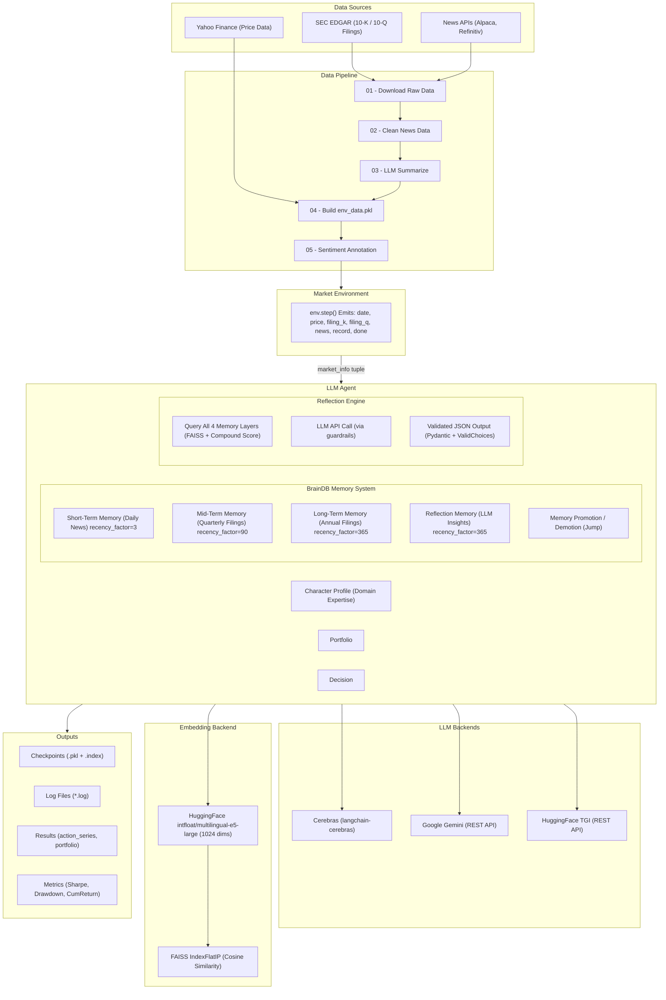

---

## 4. Module Reference

### 4.1 run.py Entry Point

Two CLI commands via [Typer](https://typer.tiangolo.com/):

| Command | Purpose |
|---------|---------|
| sim | Fresh simulation (train or test) |
| sim-checkpoint | Resume from a saved checkpoint |

**Key responsibilities:**
1. Load TOML config
2. Configure file logging
3. Deserialize `env_data.pkl` MarketEnvironment
4. Instantiate or reload LLMAgent
5. Run the main simulation loop (calls `env.step()` + `agent.step()` in lockstep)
6. Save checkpoint on every iteration (resilient to API failures)

---

### 4.2 puppy/environment.py MarketEnvironment

**Class:** MarketEnvironment

Manages the ordered sequence of trading days. Acts as a stateful iterator over a `{date: {price, filing_k, filing_q, news}}` dictionary loaded from `env_data.pkl`.

```python
market_info_type = Tuple[
 date, # current date
 float, # stock price (current day)
 str | None, # 10-K filing text (if available)
 str | None, # 10-Q filing text (if available)
 List[str], # list of news summaries
 float, # price diff (next_day - today) only meaningful in Train mode
 bool # termination flag
]
```

On each step():
- Pops the oldest date from `date_series`
- Computes `cur_record` = `future_price - cur_price` (price delta used as ground truth in training)
- Returns the 7-tuple market_info

---

### 4.3 puppy/agent.py LLMAgent

The central orchestrator. Holds references to BrainDB, Portfolio, and the LLM guardrail_endpoint.

**Key parameters from config:**

| Parameter | Description |
|-----------|-------------|
| `character_string` | Domain expertise description; used as the perpetual retrieval query |
| `top_k` | Number of memories to retrieve from each layer |
| `look_back_window_size` | Lookback window (days) for feedback & momentum calculation |
| `max_token_short/mid/long/reflection` | Token budgets for TGI truncation |

**step() method 8-stage pipeline:**

```
1. _handling_filings() store 10-K in long, 10-Q in mid memory
2. _handling_news() store news summaries in short memory
3. portfolio.update_market_info() record today's price
4. _reflect() query memories LLM call store reflection
5. construct actions Train: use price delta sign; Test: use LLM decision
6. _portfolio_step() record action, update portfolio series
7. _update_access_counter() reward/penalize memories based on 7-day P&L
8. brain.step() decay all memories, clean up, promote/demote
```

---

### 4.4 puppy/memorydb.py Memory System

#### MemoryDB (single layer)

Each layer has:
- **`universe`**: `{symbol: {"index": FAISSIndex, "score_memory": SortedList}}`
- **FAISS `IndexIDMap2(IndexFlatIP)`**: Cosine-similarity vector index
- **`SortedList`**: Items sorted by `important_score_recency_compound_score` (ascending)

Each memory entry is a dict:
```python
{
 "text": str,
 "id": int,
 "important_score": float, # [4090] initialized probabilistically
 "recency_score": float, # initialized to 1.0, decays exponentially
 "delta": int, # age counter for recency decay
 "important_score_recency_compound_score": float, # recency + importance/100
 "access_counter": int, # reward/penalty count
 "date": date
}
```

#### BrainDB (orchestrator)

Owns all 4 MemoryDB instances (short, mid, long, reflection) and a shared id_generator.

**step() performs in order:**
1. Decay + cleanup all 4 layers
2. Run 2 rounds of **inter-layer memory promotion/demotion** (jumps):
 - Short Mid (if importance 60)
 - Mid Long (if importance 80); Mid Short (if importance < 60)
 - Long Mid (if importance < 80)

---

### 4.5 puppy/reflection.py Reflection Engine

The bridge between memory retrieval and LLM-powered reasoning.

**trading_reflection():**
1. Format memory lists (handle empty with placeholders)
2. Build **Pydantic schema** dynamically using _train_reflection_factory / _test_reflection_factory
3. Build **investment info string** from memory texts + metadata
4. Call `gd.Guard.from_pydantic()` + invoke `endpoint_func` (LLM)
5. Return validated JSON dict

**Train schema output:**
```json
{
 "summary_reason": "string",
 "short_memory_index": [{"memory_index": int}],
 "middle_memory_index": [{"memory_index": int}],
 "long_memory_index": [{"memory_index": int}],
 "reflection_memory_index": [{"memory_index": int}]
}
```

**Test schema output:**
```json
{
 "investment_decision": "buy" | "sell" | "hold",
 "summary_reason": "string",
 "short_memory_index": [...],
 "middle_memory_index": [...],
 "long_memory_index": [...],
 "reflection_memory_index": [...]
}
```

---

### 4.6 puppy/chat.py LLM Client

**ChatOpenAICompatible** supports three backends:

| Backend | Detection | Protocol |
|---------|-----------|---------|
| Cerebras | model doesn't start with `gemini-pro` or `tgi` | `langchain-cerebras` SDK |
| Gemini | model starts with `gemini-pro` | Google Cloud REST API |
| TGI (HuggingFace) | model starts with `tgi` | Custom REST API with LLaMA2 prompt wrapping |

Returns a **callable guardrail_endpoint** compatible with [Guardrails AI](https://docs.guardrailsai.com/).

---

### 4.7 puppy/embedding.py Embeddings

**HuggingFaceEmb**: Wraps `langchain_community.embeddings.HuggingFaceInferenceAPIEmbeddings`.

- Model: `intfloat/multilingual-e5-large`
- Dimension: **1024**
- Handles embedding generation locally (no OpenAI requirement).

---

### 4.8 puppy/portfolio.py Portfolio Tracker

Tracks positions, market prices, and computes:
- **get_feedback_response()**: 7-day rolling P&L `{feedback: -1/0/1, date}`
- **get_moment()**: 3-day momentum signal `{moment: -1/0/1, date}`

Feedback is used to update memory importance scores (profitable decisions boost importance of the memories that influenced them).

---

## 5. Data Pipeline

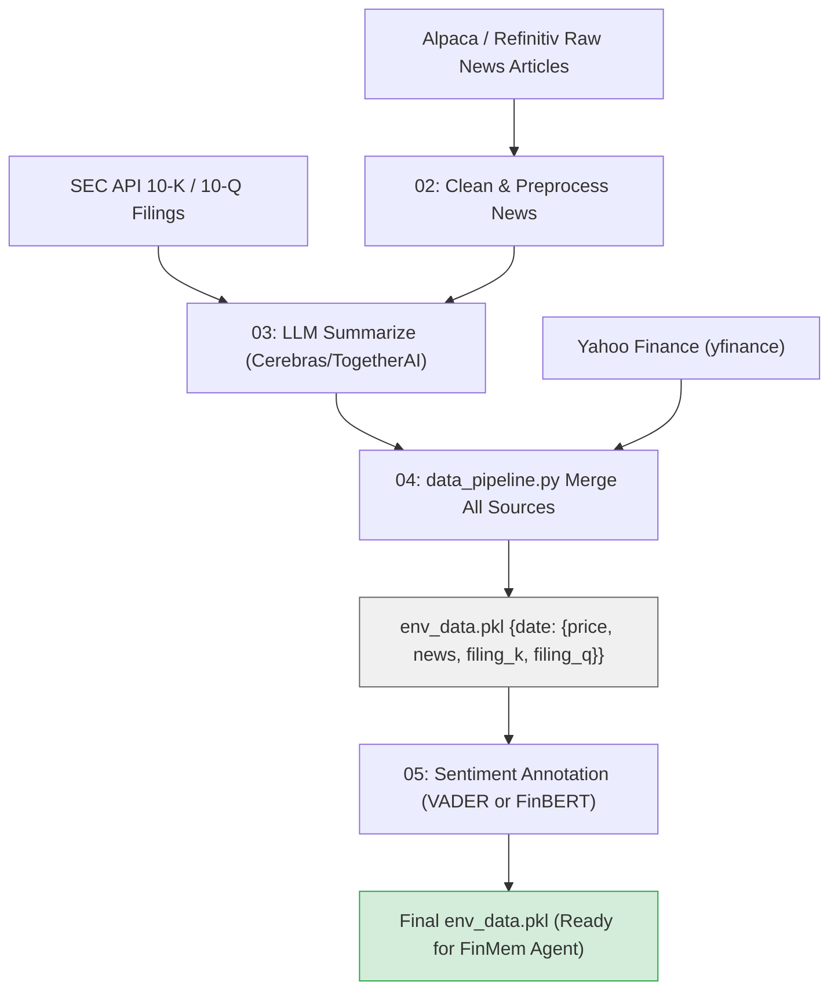

**Output format of `env_data.pkl`:**
```python
{
 datetime.date(2022, 7, 14): {
 "price": {"TSLA": 762.5},
 "news": {"TSLA": ["News summary 1...", "News summary 2..."]},
 "filing_k": {"TSLA": "Annual report text..."},
 "filing_q": {"TSLA": "Quarterly report text..."}
 },
 ...
}
```

---

## 6. Agent Lifecycle & Step Loop

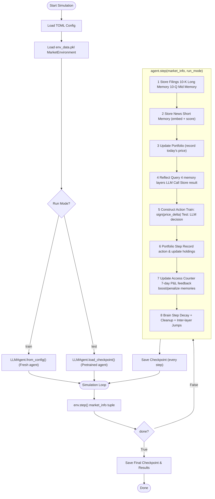

---

## 7. Memory System BrainDB

### 7.1 Layer Architecture

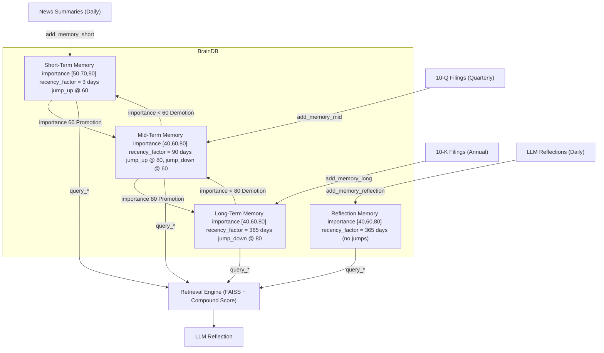

### 7.2 Memory Jump Logic (per `brain.step()`)

Two rounds of jumps are executed per day, iterating short mid long:

```
Round 1 & 2:
 Short: prepare_jump() up (importance60) Mid.accept_jump("up")
 Mid: prepare_jump() up (importance80) Long.accept_jump("up")
 down (importance<60) Short.accept_jump("down")
 Long: prepare_jump() down (importance<80) Mid.accept_jump("down")
```

---

## 8. Memory Scoring & Retrieval

### 8.1 Score Formula

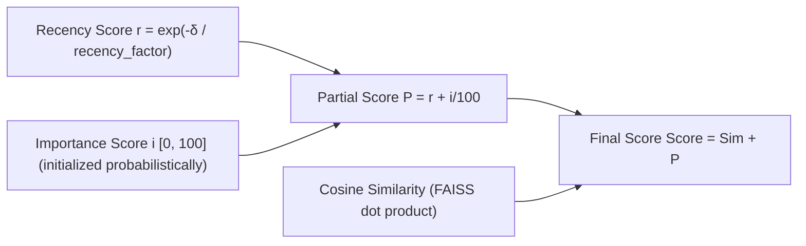

### 8.2 Retrieval Algorithm (per `MemoryDB.query()`)

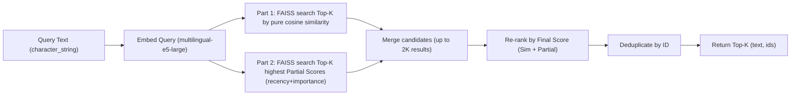

**This hybrid retrieval balances:**
- **Semantic relevance** (cosine similarity)
- **Recency** (decays exponentially with age)
- **Importance** (reinforced by profitable trade feedback)

### 8.3 Decay Functions

| Layer | Recency Factor (days) | Importance Factor | Effect |
|-------|----------------------|-------------------|--------|
| Short | 3 | 0.92 | Rapid recency decay; importance halves ~8 days |
| Mid | 90 | 0.967 | Moderate; importance halves ~20 days |
| Long | 365 | 0.988 | Slow; importance halves ~58 days |
| Reflection | 365 | 0.988 | Same as long |

**Formulas:**
```
recency_score(δ) = exp(-δ / recency_factor)
importance_score(t) = importance * importance_factor^t
```

### 8.4 Feedback Mechanism

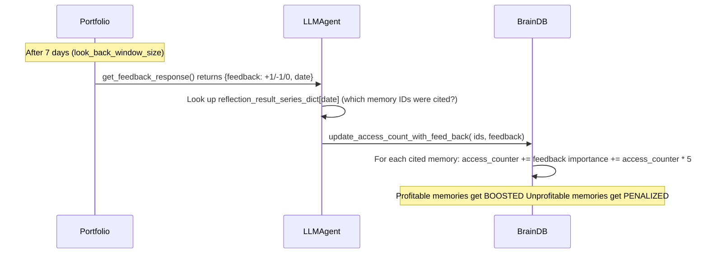

---

## 9. LLM Reflection Pipeline

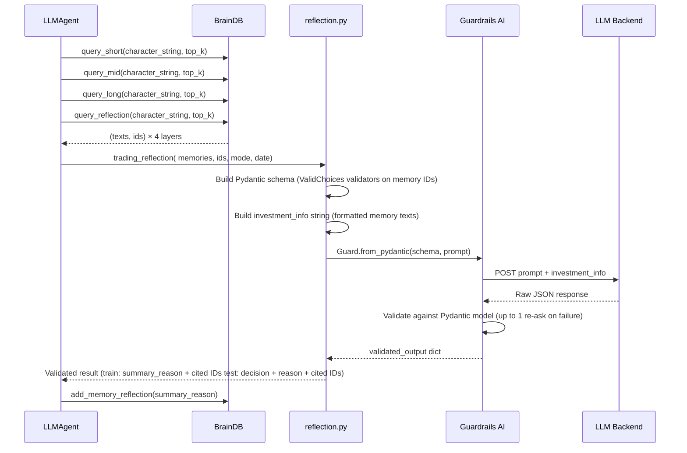

---

## 10. Portfolio & Feedback Loop

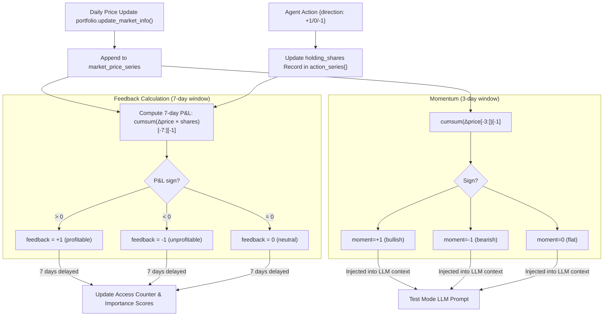

---

## 11. Train vs. Test Mode Flows

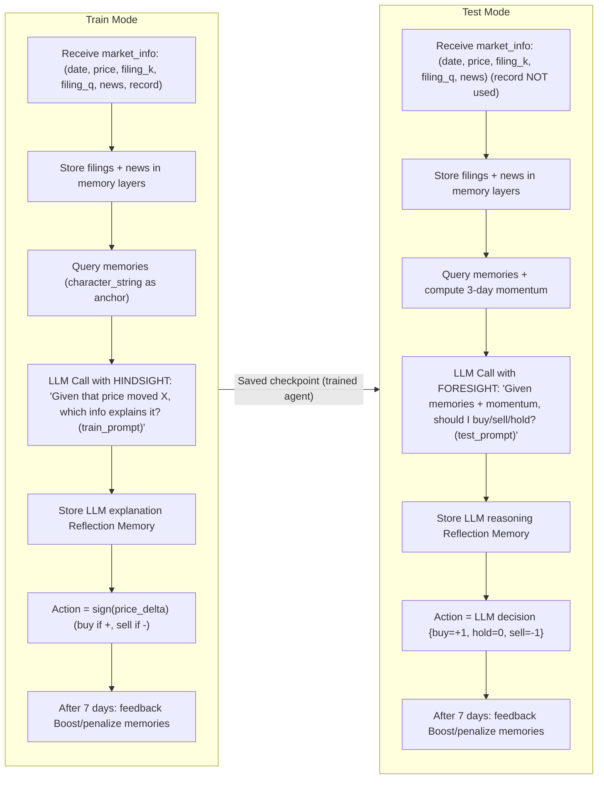

---

## 12. Configuration Reference

Config files in `config/` are TOML files. Key sections:

```toml
[chat]
model = "qwen-3-235b-a22b-instruct-2507" # LLM model identifier
end_point = "https://api.cerebras.ai/v1/chat/completions"
system_message = "You are a helpful assistant."

[general]
top_k = 3 # memories retrieved per layer per query
agent_name = "agent_1"
look_back_window_size = 7 # days for feedback P&L window
trading_symbol = "TSLA"
character_string = "..." # agent persona & domain expertise

[agent.agent_1.embedding.detail]
embedding_model = "intfloat/multilingual-e5-large"
chunk_size = 5000
verbose = false

[short]
importance_score_initialization = "sample" # probabilistic init
decay_params = {recency_factor=3.0, importance_factor=0.92}
clean_up_threshold_dict = {recency_threshold=0.05, importance_threshold=5}
jump_threshold_upper = 60 # promote to mid if importance 60

[mid]
jump_threshold_lower = 60 # demote to short if importance < 60
jump_threshold_upper = 80 # promote to long if importance 80
decay_params = {recency_factor=90.0, importance_factor=0.967}

[long]
jump_threshold_lower = 80 # demote to mid if importance < 80
decay_params = {recency_factor=365.0, importance_factor=0.988}

[reflection]
decay_params = {recency_factor=365.0, importance_factor=0.988}
```

### Importance Score Initialization (by layer)

| Layer | Score Distribution |
|-------|-------------------|
| Short | 50 (50%), 70 (45%), 90 (5%) |
| Mid | 40 (5%), 60 (80%), 80 (15%) |
| Long | 40 (5%), 60 (15%), 80 (80%) |
| Reflection | Same as Long |

**Design intent:** Short-term news starts at lower importance (more volatile), long-term filings start at higher importance (more stable).

---

## 13. LLM Provider Abstractions

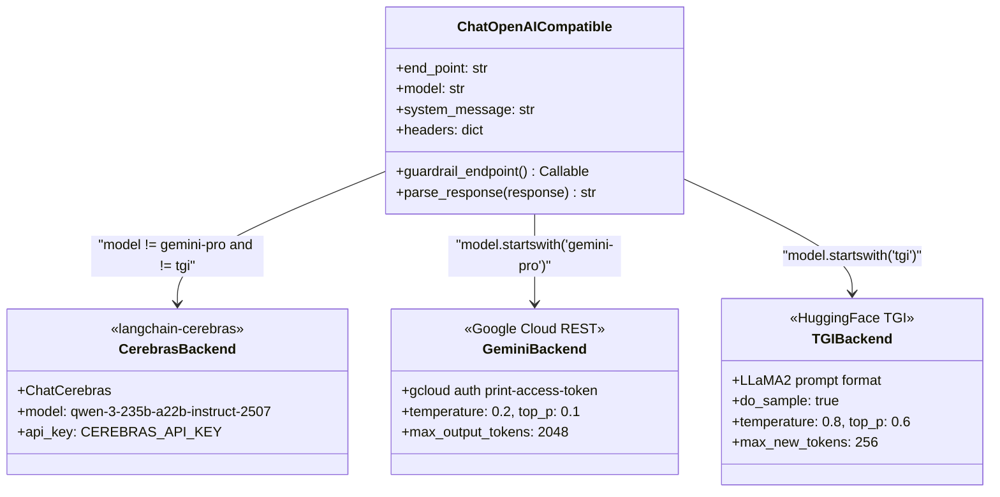

**Environment Variables:**

| Variable | Purpose |
|----------|---------|
| `CEREBRAS_API_KEY` | Required for Cerebras LLM |
| `HF_TOKEN` | Required for gated HuggingFace models and Embeddings API |

---

## 14. Checkpoint System

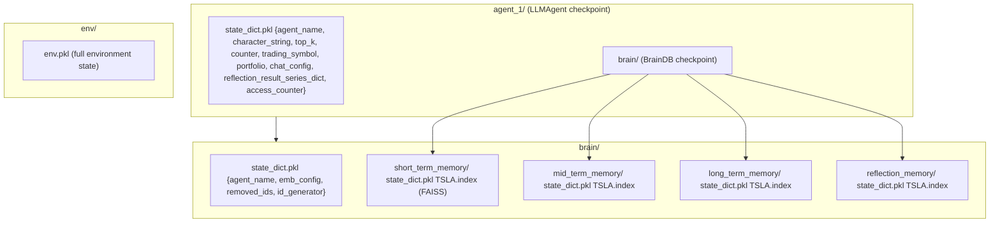

Checkpoints are saved **after every single simulation step** to protect against API failures. The `sim-checkpoint` command resumes from any saved state.

---

## 15. End-to-End Flow Diagram

```mermaid
sequenceDiagram
 participant User
 participant RunPy as run.py
 participant Env as MarketEnvironment
 participant Agent as LLMAgent
 participant Brain as BrainDB
 participant HFEmb as HuggingFace Embeddings
 participant LLM as LLM Backend
 participant Port as Portfolio
 participant FS as File System

 User->>RunPy: python run.py sim -rm train...
 RunPy->>FS: Load env_data.pkl
 RunPy->>Env: MarketEnvironment(pkl, start, end)
 RunPy->>Agent: LLMAgent.from_config(config)
 Agent->>Brain: BrainDB.from_config(config)
 Brain->>HFEmb: Initialize HuggingFace embedding client

 loop For each trading day
 RunPy->>Env: env.step()
 Env-->>RunPy: (date, price, filing_k, filing_q, news, record, done)
 RunPy->>Agent: agent.step(market_info, RunMode.Train)

 rect rgb(255, 240, 200)
 Note over Agent,Brain: Memory Storage Phase
 Agent->>Brain: add_memory_long(filing_k) if available
 Agent->>Brain: add_memory_mid(filing_q) if available
 Agent->>Brain: add_memory_short(news)
 Brain->>HFEmb: embed_documents(texts)
 HFEmb-->>Brain: float32 embeddings
 Brain->>Brain: FAISS.add_with_ids(emb, ids)
 Brain->>Brain: SortedList.add(memory_record)
 end

 rect rgb(200, 230, 255)
 Note over Agent,LLM: Reflection Phase
 Agent->>Brain: query_short(character_string, top_k)
 Agent->>Brain: query_mid(character_string, top_k)
 Agent->>Brain: query_long(character_string, top_k)
 Agent->>Brain: query_reflection(character_string, top_k)
 Brain-->>Agent: top-k texts + ids per layer
 Agent->>LLM: LLM call with memories + prompt
 LLM-->>Agent: validated JSON (train: summary; test: decision)
 Agent->>Brain: add_memory_reflection(summary_reason)
 end

 rect rgb(200, 255, 210)
 Note over Agent,Port: Action & Feedback Phase
 Agent->>Port: update_market_info(price, date)
 Agent->>Port: record_action(direction)
 Port->>Agent: get_feedback_response() [after 7 days]
 Agent->>Brain: update_access_count_with_feed_back(ids, feedback)
 end

 rect rgb(255, 210, 210)
 Note over Brain: Memory Maintenance Phase
 Brain->>Brain: decay(recency_score, importance_score)
 Brain->>Brain: cleanup(below thresholds)
 Brain->>Brain: jump(promote high-importance demote low-importance)
 end

 Agent->>FS: save_checkpoint(path, force=True)
 Env->>FS: save_checkpoint(path, force=True)
 end

 RunPy->>FS: save_checkpoint(result_path, force=True)
 User->>User: Analyze results with 06-Visualize-results.py 07-metrics.py
```

---

## Summary of Key Design Decisions

| Design Decision | Implementation Detail |
|----------------|----------------------|
| **Cognitive-inspired memory** | 3-tier hierarchy (short/mid/long) mirrors human memory; reflection is an internal monologue |
| **Memory promotion/demotion** | High importance promoted; low importance demoted (bidirectional fluid hierarchy) |
| **Hybrid retrieval** | FAISS cosine similarity + compound recency/importance score (neither pure semantic nor pure recency) |
| **Reinforcement via feedback** | 7-day delayed P&L feedback retroactively boosts/penalizes cited memory items |
| **Momentum signal** | 3-day price momentum injected into test prompt (behavioral finance insight) |
| **Guardrails validation** | Pydantic schemas with `ValidChoices` force LLM to cite only valid memory IDs and choose legal actions |
| **Character anchoring** | Domain expertise description used as the universal retrieval query to maintain consistent focus |
| **Resilient checkpointing** | Save after every step to recover from unstable API connections |
| **Dual-mode operation** | Train = memory accumulation with hindsight; Test = inference with accumulated knowledge |
